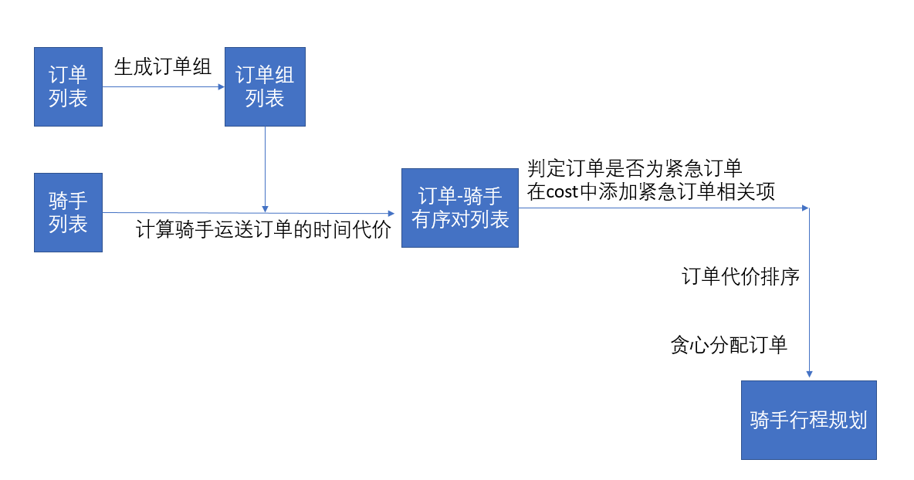

# 智慧物流：新冠期间饿了么骑士行为预估 复赛 #

### 比赛链接

<https://tianchi.aliyun.com/competition/entrance/231777/introduction>

### 基本解题思路

1. 根据cost贪心派单
2. 订单合并策略
   * 当订单较少时，合并起点或终点相近的订单
   * 当订单较多时，合并起点和终点都相近的订单
3. 优先分派将要超时的订单
4. 优先给空闲时间较长的骑手派单
5. 仅对已经空闲和在一个调度间隔内的空闲骑手的模拟派单提交到系统
6. 尽量不分配超时订单

针对骑手i,订单组j的cost可以表示为

$$ cost_{i,j}= deliverTimeCost_j+overTimeCost_j+emergencyCost_j+courierIdleCost_i $$

其中

•$deliverTimeCost_j$=最后一单运送花费时间/运单数量

•$overTimeCost_j$=订单组超时的订单数*factor_a

•$emergencyCost_j$=订单组中将要超时的订单的比例*factor_b

•$courierIdleCost_i$=骑手等待时间 *factor_c

派单程序pipline：

### 线下得分

AreaId 680507 overtimeCount: 248.000000

AreaId 680507 avgDeliveryTime: 2515.270047

AreaId 680507 overtimeRate: 0.292108

AreaId 725011 overtimeCount: 202.000000

AreaId 725011 avgDeliveryTime: 1835.453719

AreaId 725011 overtimeRate: 0.166118

AreaId 730221 overtimeCount: 256.000000

AreaId 730221 avgDeliveryTime: 2542.765331

AreaId 730221 overtimeRate: 0.208639

total overtimeRate 0.214459 aveDeliverTime 2274.407367

###  线上得分

avgDeliveryTime:3619.6574

overtimeCount:9952.0000

overtimeRate:0.2636

